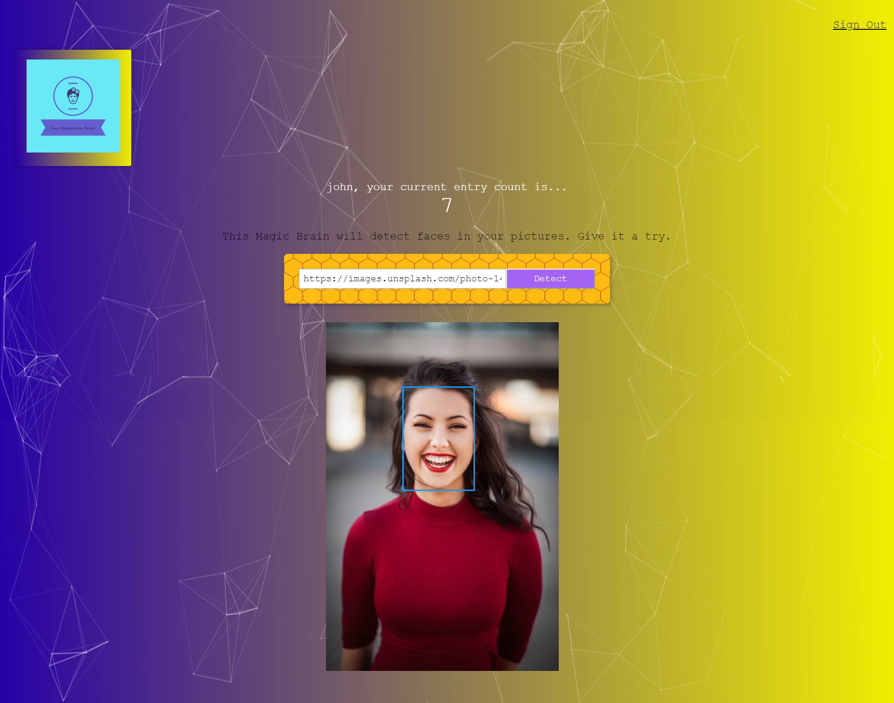

# Smart Brain
- [Live Demo](https://smart-brain-facefinder.herokuapp.com/)

Smart Brain is a web app that uses the Clarifai API to locate a face in a picture. Using a React.js front-end and Node.js backend with Express.js as well as a PostgreSQL database to keep track of how many entries every user has made.

## Technologies Used

### Front-End
- HTML5
- CSS3
- React.js

### NPM Packages
- Create-React-App
- Tachyons
- react-tilt
- particles.js
- Bcrypt
- PostgreSQL
- knex
- body parser
- cors
- express

### APIs
- [Clarifai](https://www.clarifai.com/)
- [FaceRecognitionAPI](https://github.com/vronney/faceRecognition-api)